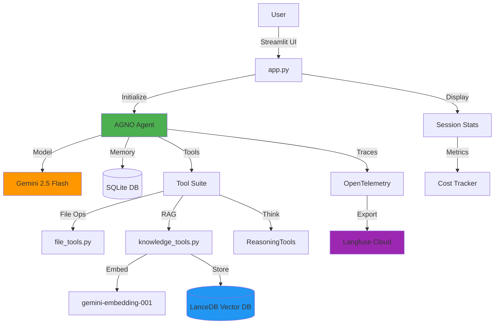
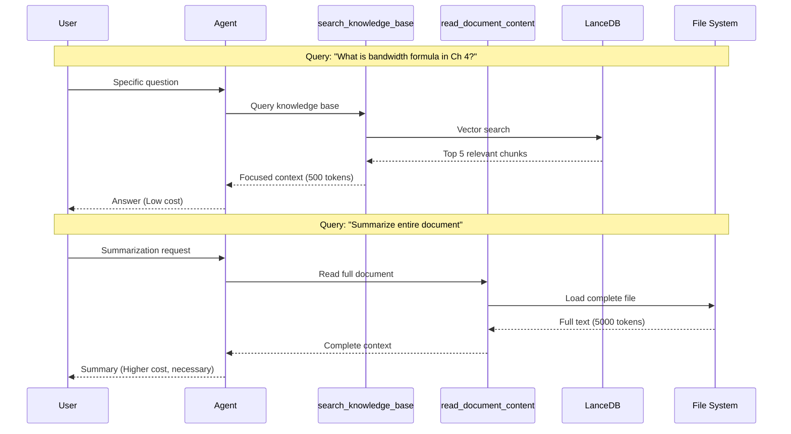
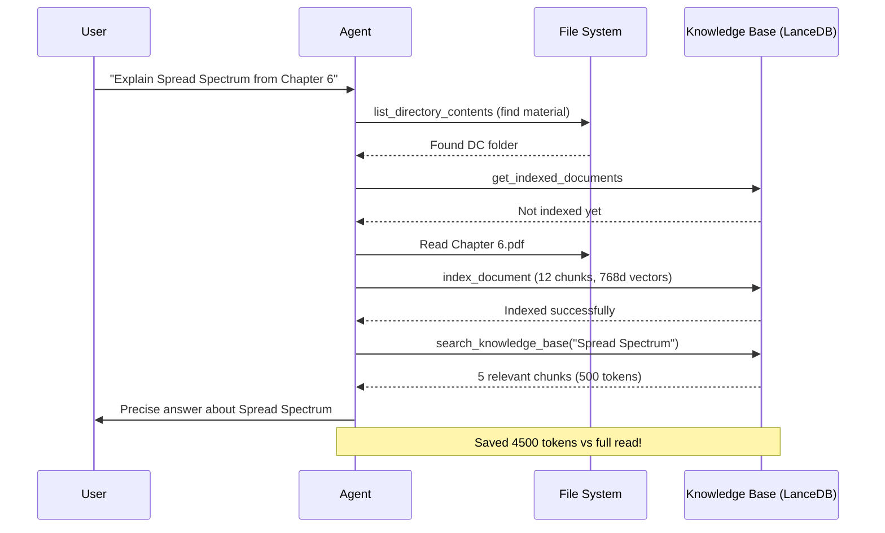

#  Local Assistant - AI-Powered File Management Agent

> An intelligent local file system assistant with RAG, memory, reasoning capabilities, and full observability powered by AGNO + Gemini 2.5 Flash

[](https://python.org)
[](https://agno.com)
[](https://ai.google.dev)
[](https://langfuse.com)

---

##  Table of Contents

- [Features](#-features)
- [Architecture](#-architecture)
- [Tech Stack](#-tech-stack)
- [Quick Start](#-quick-start)
- [Usage Examples](#-usage-examples)
- [Cost Analysis](#-cost-analysis)
- [Project Structure](#-project-structure)
- [Configuration](#%EF%B8%8F-configuration)

---

##  Features

| Feature | Description | Benefit |
|---------|-------------|---------|
| ** RAG Knowledge Base** | Vector-based document search with Gemini embeddings (768d) | 80% token savings for specific queries |
| ** User Memory** | Persistent memory across sessions (SQLite) | Learns preferences and context |
| ** Reasoning Tools** | Explicit chain-of-thought for complex tasks | Transparent decision-making |
| ** Session Management** | Auto-compress long conversations | Efficient context window usage |
| ** Cost Tracking** | Real-time token & cost monitoring | Input/output breakdown with accurate pricing |
| ** Observability** | Full Langfuse integration via OTEL | Trace all interactions, tools, RAG queries |
| ** Document Processing** | PDF, DOCX, PPTX, images via markitdown | Universal file support |
| ** Smart Tool Selection** | Context-aware tool routing | RAG for queries, full read for summaries |

---

##  Architecture



### Data Flow: RAG vs Full Document



---

##  Tech Stack

### Core Framework
| Component | Technology | Purpose |
|-----------|-----------|---------|
| **Agent Framework** | AGNO | Agent orchestration, memory, tools |
| **LLM** | Gemini 2.5 Flash | Fast, cost-effective reasoning |
| **Embeddings** | gemini-embedding-001 | 768-dim vectors for RAG |
| **Vector DB** | LanceDB | Semantic document search |
| **UI** | Streamlit | Interactive web interface |

### Observability Stack
| Component | Technology | Purpose |
|-----------|-----------|---------|
| **Tracing** | OpenTelemetry | Standard telemetry protocol |
| **Monitoring** | Langfuse | Cost tracking, trace visualization |
| **Session Tracking** | OTEL Resource Attrs | Group traces by session/user |

### Data Processing
| Tool | Library | Formats Supported |
|------|---------|-------------------|
| **Document Parser** | markitdown | PDF, DOCX, PPTX, XLSX, images |
| **File Search** | pathlib + rglob | Recursive name/content search |
| **Memory Storage** | SQLite | User preferences, chat history |

---

##  Quick Start

### 1. Prerequisites
```bash
python >= 3.11
```

### 2. Installation
```bash
# Clone the repository
git clone <repo-url>
cd AGNO-example-agent

# Create virtual environment
python -m venv .venv
source .venv/bin/activate  # Windows: .venv\Scripts\activate

# Install dependencies
pip install -r requirements.txt
```

### 3. Configuration

Create `.env` file:
```env
# Required
GOOGLE_API_KEY=your_google_api_key_here

# Optional (Langfuse observability)
LANGFUSE_PUBLIC_KEY=pk-lf-...
LANGFUSE_SECRET_KEY=sk-lf-...
LANGFUSE_BASE_URL=https://cloud.langfuse.com
```

### 4. Run

**Streamlit UI (Recommended):**
```bash
streamlit run app.py
```

**CLI:**
```bash
python local_assistant.py
```

---

##  Usage Examples

### Example 1: Auto-Index and Query Documents

**User asks about specific content without explicitly indexing:**

```
User: "Explain Spread Spectrum from Chapter 6 of DC"
```

**Agent's autonomous workflow:**
1.  `list_directory_contents` - Finds material directory
2.  `list_directory_contents` - Navigates to DC folder
3.  `list_directory_contents` - Finds lecture files
4.  `get_indexed_documents` - Checks if already indexed
5.  `index_document` - Auto-indexes Chapter 6 (12 chunks created)
6.  `search_knowledge_base` - Retrieves only relevant chunks about Spread Spectrum
7.  Returns precise answer using ~500 tokens (not full 5000+ token document)

**Key: Agent automatically indexed when needed, then used RAG for efficient retrieval!**

---

### Example 2: Smart Tool Routing

**Specific Query  Uses RAG:**
```
User: "What does section 3.2 say about bandwidth?"
Agent: Uses search_knowledge_base
       Retrieves 5 relevant chunks (500 tokens)
       Cost: $0.0004
```

**Summarization  Uses Full Read:**
```
User: "Summarize Chapter 4 of OOP"
Agent: Uses read_document_content
       Loads complete document (5000 tokens)
       Cost: $0.0018 (necessary for full context)
```

| Query Type | Tool Used | Tokens | Why |
|------------|-----------|--------|-----|
| "Explain X from Chapter Y" | `search_knowledge_base` | ~500 | Specific topic extraction |
| "Summarize entire document" | `read_document_content` | ~5000 | Needs complete context |
| "Find formula in section Z" | `search_knowledge_base` | ~500 | Targeted information |

---

### Example 3: Personalized Memory

**Agent automatically learns and remembers:**

```
Session 1:
User: "I'm working with D:\MATERIAL FOR 3RD SEM"
Agent:  [Stores in memory]

Session 2 (later):
User: "Show me the DC lectures"
Agent: [Remembers directory]  Goes directly to D:\MATERIAL FOR 3RD SEM\DC
```

**Stored Memories (viewable in sidebar):**
- `memory_id: 04e51616...` - "User has access to directory D:\MATERIAL FOR 3RD SEM"
- `memory_id: 0705890d...` - "User loves Chapter 4 of DC"
- `memory_id: ...` - "User prefers concise bullet-point answers"

**Impact:** Faster responses, no repeated questions, truly personalized experience!

---

### Example 4: RAG Workflow Visualization

**Query: "Explain Spread Spectrum from Chapter 6"**



---

##  Cost Analysis

### Gemini 2.5 Flash Pricing

| Type | Cost | Use Case |
|------|------|----------|
| **Input** | $0.30 / 1M tokens | Context + queries |
| **Output** | $2.50 / 1M tokens | Generated responses |

### Cost Comparison: RAG vs Full Read

| Scenario | Method | Tokens Used | Cost | Savings |
|----------|--------|-------------|------|---------|
| "What is X in doc?" | **RAG** (5 chunks) | 500 input + 100 output | $0.00040 | **80%**  |
| "What is X in doc?" | Full read | 5000 input + 100 output | $0.00175 | Baseline |
| "Summarize doc" | Full read (required) | 5000 input + 300 output | $0.00225 | N/A |

**Real-world example:**
- 100 specific queries with RAG: **$0.04**
- Same queries without RAG: **$0.17**
- **Savings: $0.13 (76% reduction)**

---

##  Project Structure

```
AGNO-example-agent/
  app.py                    # Streamlit web UI (main entry)
  local_assistant.py        # CLI interface
  file_tools.py             # File system operations
  knowledge_tools.py        # RAG: indexing + search
  observability.py          # Langfuse OTEL integration
  instructions.yaml         # Agent behavior & guidelines
  requirements.txt          # Python dependencies
  .env                      # API keys (gitignored)
  assistant.db              # SQLite: user memories
  knowledge_db/             # LanceDB: vector embeddings
  README.md                 # This file
```

### Key Files

| File | Purpose | Size | Complexity |
|------|---------|------|------------|
| `app.py` | Web UI, session management, cost tracking | ~450 LOC | Medium |
| `knowledge_tools.py` | RAG implementation (chunking, embeddings, search) | ~300 LOC | High |
| `instructions.yaml` | Agent persona, tool usage rules | ~140 lines | Low |
| `observability.py` | OTEL setup, session tracking, cost calc | ~150 LOC | Medium |

---

##  Configuration

### Agent Tuning

**`instructions.yaml`** controls:
- Tool selection logic (when to use RAG vs full read)
- Memory utilization patterns
- Response style and verbosity
- Proactive behavior rules

**Example customization:**
```yaml
knowledge_base_usage:
  - "Use search_knowledge_base for SPECIFIC questions"
  - "Use read_document_content for SUMMARIZATION"
  - "search_knowledge_base saves tokens"
```

### Session Management

**`app.py` constants:**
```python
MAX_HISTORY_LENGTH = 10      # Compress after N messages
COMPRESS_KEEP_RECENT = 4     # Keep recent N messages

# RAG settings (knowledge_tools.py)
CHUNK_SIZE_CHARS = 2000      # ~500 tokens per chunk
CHUNK_OVERLAP_CHARS = 200    # Context continuity
EMBEDDING_DIMENSION = 768    # Gemini embedding size
```

---

##  Observability Dashboard

### Langfuse Metrics

After setup, view in [Langfuse Dashboard](https://cloud.langfuse.com):

| Metric | Description |
|--------|-------------|
| **Traces** | Full conversation flows |
| **Sessions** | Grouped by `session.id` |
| **Users** | Tracked by `user.id` |
| **Cost** | Automatic from token counts |
| **Latency** | Tool execution times |
| **Errors** | Failed operations |

### Local UI Metrics

**Sidebar Stats:**
- Total Requests
- Total Tokens (Input/Output breakdown)
- Estimated Cost (real-time)
- Session ID & User ID
- Langfuse connection status

---

##  Advanced Features

### Session Summaries

Automatic context compression after 10 messages:
- Keeps recent 4 messages intact
- Summarizes older messages
- Reduces LLM context window usage
- Displayed with  icon in chat

### Reasoning Display

Agent can "think aloud" for complex problems:
- Uses AGNO's `ReasoningTools`
- Shown in  expandable section
- Transparent decision-making process

### Memory Viewer

Sidebar tool to inspect stored memories:
- User preferences
- Past interactions
- Context patterns
- SQLite database browser

---

##  Testing Examples

### Test RAG

```bash
# Index a document
"Index D:\docs\sample.pdf"

# Ask specific question (should use RAG)
"What does section 3.2 say about algorithms?"

# Check tool in expander - should show search_knowledge_base
```

### Test Session Compression

```bash
# Send 15 messages in one session
# After message 11, earlier messages are compressed into a summwerized version to save tokens
```

### Test Cost Tracking

```bash
# Sidebar shows:
# - Token breakdown (input/output)
# - Accurate cost calculation
# Check Langfuse for detailed trace view
```

##  License

MIT

---

##  Resources

- [AGNO Documentation](https://agno.com/docs)
- [Gemini API](https://ai.google.dev/gemini-api/docs)
- [LanceDB Docs](https://lancedb.github.io/lancedb/)
- [Langfuse](https://langfuse.com/docs)

---

**Built using AGNO Framework**
